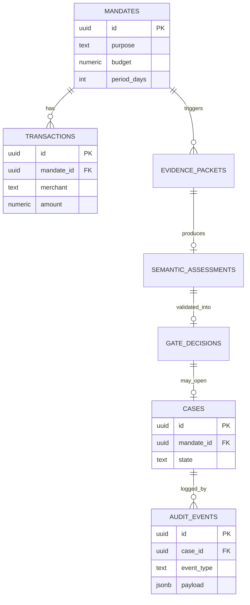

# System Architecture — Mandate Drift Guard
*Razorpay AI Buildathon, Track 02 — Draft v1*

This document specifies the production-quality prototype architecture to build against. It does
not reopen the three-layer pipeline or fail-closed gate (locked in the brief) — it decides
everything below that: frameworks, storage, API shape, state machine, security boundaries, and
build order. Anywhere this doc makes a call the other three docs left open, it's marked
**[CARRIED DECISION]** and needs your sign-off before code starts.

---

## 0. Constraints this design is optimized against

- Solo builder, 8 days to Sept 5, Claude Code implements, you own every architectural decision and
  must defend it in a panel interview.
- The submission is judged on engineering/evaluation rigor, not feature count or infra
  sophistication (brief, product spec, and your own operating principles all say this explicitly).
- No real Razorpay integration exists or is claimed — this is a synthetic-data prototype end to
  end. That single fact simplifies almost every decision below: there is no live payment rail to
  integrate with, no production traffic to scale for, and no real financial risk if something
  breaks.

---

## 1. Architecture comparison

### Architecture A — Synchronous monolith pipeline

One backend service. A transaction-ingestion request runs the full pipeline (evidence engine → LLM
call → gate) inline, in-process, and returns the decision in the same HTTP response. No message
queue, no background workers, no separate services. Postgres for storage. The evaluation harness
imports the same pipeline code directly (not via HTTP) and runs it in a loop over fixture files.

### Architecture B — Event-driven worker pipeline

Ingestion API publishes a transaction event to a queue (Redis Streams or a lightweight broker). A
worker pool consumes events, runs the evidence engine, and — if a threshold is crossed — publishes
an "evidence-ready" event to a second queue for LLM workers, which publish gate-ready events, which
a gate worker consumes and writes to the audit log. HOLD cases publish to a notification queue for
the UI. This is closer to what a real agentic-commerce risk pipeline would look like at Razorpay's
actual transaction volume.

### Architecture C — Autonomous multi-tool agent (rejected outright, not compared in depth)

An LLM-orchestrated agent with tool access (query transaction DB, call evidence functions, decide
and execute the gate outcome itself). Rejected immediately: it violates the brief's own
architecture (§8 product spec explicitly says this is "not an autonomous agent in the tool-calling
sense") and principles 3, 9, 12, 13 — it would hand the LLM either tool access it doesn't need or,
worse, execution authority over financial-adjacent decisions. Including it here only to show it was
considered and dismissed for a stated reason, not overlooked.

### Comparison — A vs B

| Axis | A: Synchronous monolith | B: Event-driven workers |
|---|---|---|
| **Correctness** | Easier to reason about — one request, one linear execution path, no distributed race conditions between evidence computation and gate decision. | Correctness now depends on message ordering and delivery guarantees (at-least-once vs exactly-once) across three queues — a new class of bug this project doesn't need. |
| **Explainability** | A single stack trace or log line covers one case end to end. | A single case's story is scattered across three worker logs correlated by a message ID — harder to hand a judge a clean "here's exactly what happened." |
| **Safety** | Fail-closed logic lives in one function call chain — trivial to unit-test exhaustively (the injected-failure fixtures in the eval doc map 1:1 to function calls). | Fail-closed logic must also handle *queue*-level failure modes (message lost, worker crashes mid-processing, duplicate delivery) — more failure surface for the same safety property, and none of it is required by the actual problem being solved. |
| **Evaluation** | The eval harness calls pipeline functions in-process — deterministic, fast, no infra dependency. Matches the eval doc's own anti-cherry-picking requirement (one batch script, one pass) cleanly. | Running the eval harness means standing up the same queue infra, or maintaining a second "direct-call" code path for eval only — either extra infra or a correctness risk that eval and production diverge. |
| **Maintainability** | One service, one deploy, one set of logs. A solo builder can hold the whole system in their head. | Three worker types plus a broker is meaningfully more moving parts to keep consistent, for a system that will never see the throughput that justifies it. |
| **Implementation feasibility (8 days)** | Fits comfortably. | Would consume days on infra (broker setup, worker lifecycle, retry/dead-letter handling) that should go to the evidence engine, prompt design, and the paired-scenario dataset — the parts that actually carry the project's technical claim. |
| **Demonstration quality** | A judge can read one function call chain and see the fail-closed property directly. | A judge sees more infrastructure, which risks reading as "impressive plumbing" rather than "rigorous risk system" — and Track 02 rewards the latter (principle 14: optimize for engineering signal, not feature count). |

**Decision: Architecture A.** Nothing about this problem has throughput, ordering, or
multi-consumer requirements that justify an event bus — a single ingestion request maps to exactly
one evidence computation, at most one LLM call, and one gate decision. Architecture B's real-world
motivation (handling agentic-commerce volume in production) is a legitimate future-scaling
argument, and it belongs in the write-up as a **stated non-goal with a reason**, not as something
built now. That's a stronger interview answer than building B and having it be untested,
under-evaluated infrastructure that dilutes the 8-day budget.

**Consequence:** the "event/state management" section below still defines a formal state machine
(§6) — that discipline is worth keeping even without a message bus, because it's what makes the
audit log and the failure-injection tests in the eval doc well-defined.

---

## 2. Chosen architecture — component overview

```
┌─────────────────────────────────────────────────────────────────────┐
│                          Frontend (SPA)                              │
│   Case list · Case detail (evidence, reasoning, decision) · Resolve  │
└───────────────────────────────┬───────────────────────────────────────┘
                                 │ REST (JSON), bearer token on writes
┌───────────────────────────────▼───────────────────────────────────────┐
│                        Backend (single service)                       │
│                                                                        │
│  Ingestion API ──▶ Evidence Engine ──▶ Evidence Packet                │
│                          (①, deterministic, no AI)                    │
│                                │                                       │
│                                ▼                                       │
│                     Semantic Risk Client                              │
│                          (②, one Anthropic API call, stateless)        │
│                                │                                       │
│                                ▼                                       │
│                        Policy Gate                                    │
│                    (③, deterministic, versioned thresholds)            │
│                                │                                       │
│              ┌─────────────────┼─────────────────┐                    │
│              ▼                 ▼                 ▼                    │
│           ALLOW              HOLD              (from HOLD) BLOCK      │
│                                │                                       │
│                       Case Resolution API                             │
│                     (human confirm/deny/timeout)                      │
│                                                                        │
│              Every stage writes to: Audit Event Log (append-only)     │
└───────────────────────────────┬───────────────────────────────────────┘
                                 │
┌───────────────────────────────▼───────────────────────────────────────┐
│                            Postgres                                   │
│   mandates · transactions · cases · audit_events · dataset_cases      │
└─────────────────────────────────────────────────────────────────────┘

                    ┌─────────────────────────────────┐
                    │  Evaluation harness (offline CLI) │
                    │  imports the same pipeline code   │
                    │  directly — no HTTP, no DB dep     │
                    │  reads fixtures/, writes results/  │
                    └─────────────────────────────────┘
```

An inline diagram of this pipeline and the case state machine (§6) has been rendered above in
chat.

---

## 3. Component responsibilities

| Component | Owns | Does not own |
|---|---|---|
| **Ingestion API** | Accepting a transaction event, validating its shape, invoking the pipeline synchronously, returning the resulting decision. | Any interpretation of whether the transaction is risky. |
| **Evidence Engine (①)** | Computing spend velocity, category-shift magnitude, and clustering from the transaction stream + historical baseline. Pure functions, no side effects, fully unit-testable without a DB. | Any judgment about *meaning* — it never asks "does this still match the mandate's purpose." |
| **Semantic Risk Client (②)** | Constructing the LLM prompt from the evidence packet, calling the Anthropic API once, validating the response against the output schema. | Deciding ALLOW/HOLD/BLOCK. Never writes to the DB directly — returns a validated object to the caller. |
| **Policy Gate (③)** | The ALLOW/HOLD/BLOCK mapping, using versioned thresholds. The single place fail-closed logic lives. | Any LLM call, any evidence computation. |
| **Case Store** | Current state of every case that reached HOLD or later — the read-optimized view the frontend queries. | Historical/immutable truth — that's the audit log's job, not this table's. |
| **Audit Event Log** | Append-only record of every stage's output, keyed by case_id. Sufficient alone to reconstruct and defend one decision. | Nothing else — it is intentionally a dumb, wide, insert-only log, not a queryable business-state table. |
| **Evaluation Harness** | Running the pipeline over fixtures, producing a results file, computing the metrics in evaluation-design.md from that file. | Live traffic, the demo UI, anything user-facing. |
| **Frontend** | Displaying case state, evidence, reasoning, and the resolve action. | Any decision logic — it renders what the backend already decided. |

---

## 4. The AI system, precisely

Per your requested framing — **Input → Context construction → Model reasoning → Structured
decision → Policy validation → Tool execution → Verification → Outcome → Audit** — mapped exactly
onto this architecture:

1. **Input.** The AI system's input boundary is the **evidence packet**, not the raw transaction
   stream. This is deliberate and worth stating as its own safety property: the AI never sees raw
   merchant text, raw transaction rows, or anything the evidence engine didn't already select and
   summarize. Bounding the input surface is what makes §5's schema-boundary claim (no
   merchant-content injection path) structurally true rather than merely policy-asserted.
2. **Context construction.** A fixed system prompt (task instructions + the exact output schema)
   plus the evidence packet serialized as the user message. No retrieval, no chat history, no
   few-shot examples in MVP (add if dev-set iteration shows the model needs them — track as a
   prompt-version change, see §11). Every call is stateless — no memory of prior calls, matching
   product spec §8's stated bounding property.
3. **Model reasoning.** One completion call to a current-generation Claude model, pinned to an
   exact model string in config (not "latest") so results are reproducible run-over-run — a
   detail that matters directly for the locked-test-set protocol in the eval doc. **Structured
   output is obtained via a forced single tool call** (`tool_choice` forcing exactly one
   `emit_risk_assessment` call with a strict JSON schema) — this is a *structured-output
   mechanism*, not agentic tool use. Worth stating explicitly in the pitch, because product spec
   §11 says "the AI has no tools in the agentic sense" and a sharp interviewer will ask whether
   forcing a tool call contradicts that. It doesn't: the "tool" here never executes anything, has
   no side effects, and exists purely to guarantee schema-valid JSON instead of parsing free text.
4. **Structured decision.** The forced tool call's arguments are parsed and validated against a
   Pydantic model matching the brief's exact schema (`mandate_alignment`, `risk_level`,
   `confidence`, `evidence[]`). Any validation failure (missing field, wrong type, out-of-range
   confidence) is treated identically to a malformed response — see §10.
5. **Policy validation.** The Policy Gate function receives the validated assessment plus the
   deterministic signals and applies the versioned rule table (§8) to produce ALLOW or HOLD. This
   is the one place the fail-closed invariant is enforced, and it is unit-tested against every
   failure-injection fixture in the evaluation doc (§13 of that doc) directly, not sampled.
6. **Tool execution.** **None.** Nothing in this pipeline calls any tool that mutates external
   state — no payment API, no mandate mutation, no messaging side effect. The only "execution" is
   a database write of the decision record, performed by ordinary backend code, never by the LLM
   or in response to LLM-generated instructions. This is the single most defensible sentence in
   the whole submission and it should appear in the pitch deck verbatim.
7. **Verification.** Three checks, none of them "trust the model":
   - *Schema-boundary integrity* (offline test): confirm the evidence-packet schema has no field
     capable of carrying arbitrary merchant-supplied text into the LLM's instruction context —
     checked by exact string-containment tests against the failure fixture in eval doc §13-#4.
   - *Confidence-correctness calibration* (offline, on the held-out set): point-biserial
     correlation + Brier score, per eval doc §8. Until this check passes, raw `confidence` is
     **not trusted** by the gate — see §8 below for what the gate uses instead.
   - *Gate-rule violation count* (run over every case, dev and test): proves the implemented gate
     never contradicts its own stated rule table, per eval doc §14.
8. **Outcome.** ALLOW / HOLD / BLOCK persisted as the case's current state. HOLD makes the case
   visible in the case list for resolution.
9. **Audit.** Every one of the above stages' output is appended as an immutable event, keyed to
   `case_id` — mandate snapshot, computed signals, full evidence packet, full raw LLM response
   (including the raw self-reported confidence, even though the gate may not trust it), the gate
   decision and the exact rule version that produced it, and later the human resolution.

---

## 5. Data model

Postgres. No ORM opinion imposed here — SQLAlchemy or a lighter query layer are both fine; not
worth spending a decision-cycle on for a solo 8-day build. Core tables:

**`mandates`**
`id, purpose (text), budget, period_days, allowed_categories (text[]), created_at`
— includes the project's proposed semantic-purpose field, explicitly annotated in code comments
and the pitch as "our own enrichment, not Razorpay's confirmed pilot schema" (per the brief's
honesty fix).

**`transactions`**
`id, mandate_id (FK), merchant, category, amount, occurred_at, ingested_at, idempotency_key (unique)`

**`evidence_packets`** *(one per triggered evaluation, not one per transaction — most transactions
never cross a threshold and never get one)*
`id, mandate_id (FK), signals (jsonb), trajectory (jsonb), created_at`

**`semantic_assessments`**
`id, evidence_packet_id (FK), mandate_alignment, risk_level, confidence, evidence (jsonb array),
raw_response (jsonb), model_version, prompt_version, latency_ms, created_at`

**`gate_decisions`**
`id, semantic_assessment_id (FK, nullable — null on timeout/malformed-output paths), decision
(allow/hold), rule_version, rule_applied (text — human-readable reason), created_at`

**`cases`** *(read-optimized current-state view; only rows that reached HOLD or later get a case;
ALLOW-without-HOLD cases exist only in the audit log, per the product journey's "most mandates
never leave nominal" note)*
`id, mandate_id (FK), gate_decision_id (FK), state (hold / resolved_allow / resolved_block),
opened_at, resolved_at, resolved_by, resolution_reason`

**`audit_events`** *(append-only — see §14 for the enforced-immutability mechanism)*
`id, case_id (nullable — some audit events precede case creation), event_type, payload (jsonb),
created_at`

**`dataset_cases`** *(fixtures metadata, used by the eval harness — kept separate from the "live
demo" tables above)*
`id, split (dev/test), category (legitimate/drift/ambiguous), drift_type (fast_spike/slow_drift/
n_a), paired_with_id (nullable), ground_truth_label, rationale (text), fixture_path`



---

## 6. Case state machine

States and transitions, exactly matching the brief's fail-closed diagram — reproduced precisely
because the earlier docs establish that the gate **never outputs BLOCK directly**; BLOCK is only
reachable through a HOLD.

```
EVALUATING
   ├── low risk, high confidence ──────────────▶ ALLOW (terminal)
   └── medium/high risk, OR any uncertainty/
       timeout/malformed-output ────────────────▶ HOLD
                                                     ├── human confirms ──▶ ALLOW (terminal)
                                                     ├── human denies ────▶ BLOCK (terminal)
                                                     └── resolution timeout ▶ BLOCK (terminal)
```

An inline version of this diagram has been rendered above in chat. Every arrow in this diagram
corresponds to exactly one Policy Gate code path, and every one of those paths has a dedicated
failure-injection fixture in evaluation-design.md §13 — this is the traceability principle (15)
applied concretely: requirement → architecture → test.

---

## 7. API boundaries

| Method + path | Auth | Purpose | Side effects | Idempotent? |
|---|---|---|---|---|
| `POST /mandates` | none (demo/seed use) | Create a mandate (fixture/demo loading) | Insert | No |
| `POST /mandates/{id}/transactions` | none (demo use) | Ingest a transaction, runs the full pipeline synchronously | Insert transaction; may insert evidence_packet, semantic_assessment, gate_decision, case, audit_events | Yes — keyed on `idempotency_key`; re-submitting the same key returns the original decision, does not re-run the pipeline |
| `GET /cases` | none | List cases, filterable by state | none | Yes |
| `GET /cases/{id}` | none | Full case detail: evidence packet, raw LLM response, gate rationale, audit trail | none | Yes |
| `POST /cases/{id}/resolve` | **bearer token required** | Human resolves a HOLD: confirm → ALLOW, deny → BLOCK | Insert audit_event, update case.state | Yes — resolving an already-resolved case returns 409, does not double-write |
| `GET /health` | none | Liveness check | none | Yes |

The evaluation harness deliberately does **not** go through this API — it imports the Evidence
Engine, Semantic Risk Client, and Policy Gate modules directly in-process. Two reasons: (a) speed —
a 100-case batch run over HTTP adds latency and a server dependency for no benefit; (b)
reproducibility — the eval doc's anti-cherry-picking rule requires one batch script producing one
results file, and coupling that to a running API server is an unnecessary dependency to keep
alive and versioned correctly.

**[CARRIED DECISION]** Only one endpoint above (`resolve`) requires auth. This follows directly
from operating principle 8 ("treat financial actions as high-risk operations requiring explicit
boundaries") — `resolve` is the one endpoint with a consequential, human-triggered effect. Every
other endpoint is read-only or demo-seeding. If you want ingestion itself gated too (e.g., so a
public demo link can't be used to spam-create cases), say so — it's a five-line change, but it's
worth deciding, not defaulting.

---

## 8. AI / LLM layer detail

- **Provider/model**: Anthropic API, a current-generation Claude model, pinned to an exact model
  string in a config file (not resolved at request time) — pin changes are a reviewable diff, not
  a silent behavior change.
- **Call shape**: single message, forced tool call for structured output (§4 step 3), hard timeout
  (recommend starting at 10s, tune against observed p95 latency from eval doc §17), temperature
  low (e.g. 0–0.2) since this is a classification task, not creative generation — deterministic-ish
  behavior is desirable here even though full determinism isn't guaranteed.
- **What the gate actually trusts**: per eval doc §8/§16, self-reported `confidence` is *not*
  trusted until the calibration check passes on the held-out set. **Concrete recommendation**:
  build the gate to accept a `confidence_source` config flag — `raw` or `evidence_completeness_
  proxy` — defaulting to the proxy (a simple, fully deterministic function of evidence-packet
  completeness: how many signals were present, whether historical baseline existed, etc.) until
  the calibration metric on the dev set shows raw confidence correlates positively and
  significantly with correctness. This makes the "what if confidence isn't calibrated" question
  a **pre-answered design decision**, not a scramble on day 7. Flip the flag if/when the dev-set
  check passes; report whichever was actually used in the pitch, honestly.

---

## 9. Policy engine — the disagreement-handling rule

**[CARRIED DECISION]** Product spec's open item #3 (disagreement between deterministic signals and
the LLM's stated risk) blocks failure fixture #6 in the eval doc from being scored until it's
decided. Proposed rule, consistent with the fail-closed philosophy already locked elsewhere in
this project:

> **The gate never downgrades toward ALLOW based on the LLM's word alone.** If deterministic
> signals were mild enough that the evaluation threshold wasn't crossed, layer ② is never invoked
> — nothing to disagree about. If the threshold *was* crossed (meaning the deterministic layer
> already flagged this case as worth a second look) but the LLM reports low risk, the gate still
> requires medium-or-higher LLM-reported risk *and* passing confidence to reach ALLOW — a
> low-risk LLM read on a signal-flagged case is treated as **insufficient to override** the
> signal, not as grounds to clear it, and routes to HOLD. Conversely, if signals are mild
> (below threshold — layer ② wasn't even called) that state cannot occur, by construction, so
> "signals mild, LLM says high risk" is not a reachable state either.

Stated plainly: because layer ② is only ever invoked *after* a deterministic threshold crossing,
true bidirectional disagreement is narrower than it first appears — the only live case is "signals
crossed the threshold, but the LLM downplays it," and the rule above resolves that in the
fail-closed direction. **This needs your explicit sign-off** — it's a real interview question and
the answer needs to be yours, defensible on the stand, not something Claude Code inferred silently
while building.

Thresholds themselves are stored as a versioned config object (`policy_version: "v1"`, exact
numeric cutoffs), and every `gate_decisions` row records which version produced it — this is what
makes eval doc §14's "gate-rule violation count" metric checkable after the fact, and what lets the
rules-only baseline's threshold sweep (eval doc §5) be reproduced exactly.

---

## 10. Error handling, retry, idempotency, rate limits

- **Retry policy** *(carries over eval doc open item #4)*: **[CARRIED DECISION] No retry on
  malformed LLM output — straight to HOLD.** Matches the eval doc's own preference ("simpler and
  arguably more defensible — fewer moving parts, same safety outcome") and keeps the
  failure-injection fixtures deterministic to test. **One retry on transport-level failure only**
  (connection error, 5xx from the API) with a short backoff, before falling to HOLD-on-timeout —
  this is a resilience concern distinct from "the model's answer was bad," and conflating the two
  would make fixture #1 (simulated timeout) untestable in isolation.
- **Idempotency**: transaction ingestion requires a caller-supplied `idempotency_key`; a repeat
  submission with the same key returns the original decision without recomputing signals or
  re-calling the LLM — protects against double-processing on client retry, and matters more than
  it looks like it does, since a duplicated transaction would silently corrupt the velocity/
  category-shift signal computation for that mandate.
- **Rate limits (Anthropic API)**: the ingestion path (one call per triggered case, low volume)
  needs no special handling beyond the transport retry above. The **eval harness** is the actual
  rate-limit risk — a 60+ locked-test-set batch run is a burst of calls. Bound eval-harness
  concurrency with a semaphore, add exponential backoff specifically on HTTP 429, and treat this
  as a distinct concern from the "AI was uncertain → HOLD" logic — a 429 is a *transport* failure
  the harness should retry and recover from, not a case outcome to score.
- **Rate limits (ingestion API)**: basic per-token request-rate limiting on the demo endpoints is a
  reasonable light touch (e.g. `slowapi`), mainly to keep a public demo link from being abused —
  not a hard requirement for Track 02 scoring, worth adding only if time permits.
- **Pipeline exceptions**: any unhandled exception during evidence computation, the LLM call, or
  gate evaluation is caught at the top of the ingestion handler and converted to a HOLD with an
  audit event recording the exception — matching eval doc §16's "pipeline error rate should be
  zero" bar by ensuring a crash never silently drops a case or, worse, defaults to ALLOW.

---

## 11. Evaluation harness architecture

Two decoupled stages, matching the eval doc's anti-cherry-picking rule and the dev/locked-test
split:

1. **`eval/run.py`** — loads fixtures from `fixtures/{legitimate,drift,ambiguous}/`, runs each
   case through both the rules-only baseline and the full hybrid pipeline (in-process imports, no
   HTTP), and writes one line per case to a results file (`results/{split}-{timestamp}.jsonl`)
   containing every intermediate output (signals, evidence packet, raw LLM response, gate
   decision, latency). This script also runs the dedicated failure-injection fixtures from the
   eval doc's table (§13–14) in the same pass. **Guardrail**: running against the `test` split
   requires an explicit `--confirm-locked-test-set` flag that prints a warning and the current
   git commit hash to the results file header — a small, deliberate friction point that makes
   "touched exactly once" enforceable rather than aspirational.
2. **`eval/report.py`** — reads a results file and computes every metric in
   evaluation-design.md §7–18 from the formulas already specified there. Decoupled from stage 1 so
   metrics can be recomputed or re-checked without spending another LLM call — this also means the
   results file itself becomes a durable, inspectable artifact you can hand a judge directly.
- **Prompt/model versioning**: every `semantic_assessments` row (live or eval) records
  `model_version` and `prompt_version`. Changing the layer-② prompt during dev-set iteration bumps
  `prompt_version`; this is what lets you state precisely which prompt version produced the final
  reported numbers, and prevents the common failure mode of quietly editing a prompt after seeing
  results.

---

## 12. Observability

Deliberately lightweight — no APM stack, no metrics backend:

- Structured (JSON) logs at each pipeline stage, correlated by `case_id` / `mandate_id`. This is
  the debugging surface, not the audit surface — audit is a product output (§14); logs are an
  engineering convenience and are fine to be less permanent.
- Latency is captured **inside the audit event payload itself** (per-stage `*_ms` fields), which
  directly produces the p50/p95/p99 numbers eval doc §17 asks for, without standing up separate
  observability infra.
- **Post-MVP note, stated honestly rather than pretended-away**: a real Prometheus/Grafana setup
  would be the right call at production scale; it's explicitly not built here because it would be
  infra for infra's sake against an 8-day, single-demo-instance clock (principle 12/13).

---

## 13. Deployment

- **Local/dev**: `docker-compose.yml` with two services — the backend (FastAPI) and Postgres. The
  frontend runs via its own dev server against the backend during development.
- **Demo deployment**: a single small managed host (e.g. Render/Fly.io/Railway) running the same
  Docker image, with a managed Postgres instance — enough for a live pitch-video demo link, nothing
  more. No autoscaling, no multi-region, no Kubernetes — there is exactly one demo audience and it
  is not a scaling problem.
- **Fixtures and eval results ship in the repo**, not the deployed DB — the deployed demo instance
  is seeded with a small illustrative subset of cases (including the Case-A/Case-B pair used in
  the pitch's visual moment), kept separate from the full locked-test-set run, whose results file
  is committed to the repo as the source of truth for the numbers in the pitch deck.

---

## 14. Security boundaries

- **AI has zero execution authority** — structurally, not just by prompt instruction. The LLM
  client function's return type is a validated Pydantic object; nothing downstream ever executes,
  evaluates, or interprets LLM-generated text as code or as a direct instruction. This is the
  architecture's core defensible claim and it is enforced by the type boundary between the
  Semantic Risk Client and the Policy Gate, not by asking the model nicely.
- **Structural (not instructional) merchant-content isolation**: the evidence-packet schema has no
  field capable of holding raw merchant free text — category and merchant name are constrained to
  short structured values, never freeform description fields, so there is no field for adversarial
  text (fixture eval doc §13-#4) to occupy in the first place. This is checked by a schema test,
  not a prompt-injection defense — reaffirms the brief's explicit non-goal (defeating prompt
  injection is out of scope; *structurally preventing the attack surface from existing* is a
  different, cheaper, and stronger claim that doesn't require solving the injection problem at
  all).
- **DB least privilege**: the application's DB role has `INSERT, SELECT` on `audit_events` — no
  `UPDATE` or `DELETE` grant. This is a real, enforced boundary (not just "we don't write update
  code for this table") and is a concrete, checkable detail worth naming in the pitch: append-only
  is a database-level guarantee, not an application-level convention.
- **No live payment paths exist anywhere in this system.** Worth stating explicitly and often —
  the entire system is a read/decision layer over synthetic data; there is no code path that could
  move real money even by accident.
- **Auth surface is intentionally minimal** (§7) — a single static bearer token gates the one
  consequential write endpoint. This is explicitly named as a demo-scale simplification, not a
  production security posture, in both the repo README and the pitch — silence on this point would
  read as either not understanding the gap or hoping nobody asks.

---

## 15. Human approval

- The **only** human-in-the-loop point in the system is HOLD resolution (`POST
  /cases/{id}/resolve`), matching product spec §14/§18.
- **[CARRIED DECISION]** Who resolves it: per product spec §2's own recommendation (Ops-analyst-
  primary, matching Track 02's "AI Risk Manager" framing), this architecture assumes a single Ops-
  analyst role resolving cases via the case-detail UI — not a consumer-facing confirmation flow.
  This is carried, not decided fresh, but it is still the single open item most worth a deliberate
  "yes, confirmed" from you, since it shapes §7's auth model and the entire frontend.
- **Resolution timeout**: implemented as a lightweight scheduled check (an `asyncio` background
  task or a simple cron-triggered endpoint is enough at demo scale — no durable job scheduler
  needed) that resolves any HOLD past its timeout window to BLOCK and writes the audit event.

---

## 16. Technology choices — summary

| Layer | Choice | Rejected alternative | Why |
|---|---|---|---|
| Backend framework | FastAPI (Python) | Flask / Django | Native async, Pydantic integration doubles as the LLM-output-schema validator, matches the Python-native Anthropic SDK. |
| Database | Postgres | SQLite | Real grant-level restriction on `audit_events` (§14) is a concrete security-boundary demo point; SQLite's concurrent-write and role-permission model is weaker for that specific claim. Docker Compose makes the extra service free in practice. |
| Frontend | Vite + React + TypeScript SPA | Next.js | No SSR/routing complexity is needed for a single case-list + case-detail view; a plain SPA against a REST backend is less to build and less to explain. |
| Agent orchestration framework | None — direct API calls | LangChain / LangGraph / CrewAI | The AI step is one bounded classification call, not a multi-step agent loop (product spec §8). A framework here is complexity with no matching requirement — principle 12/13. |
| Message queue | None | Redis Streams / Kafka | See §1 comparison — no throughput/ordering requirement justifies one. |
| Auth | Single static bearer token on one endpoint | Full OAuth/RBAC | Matches actual risk surface (§14) — one consequential endpoint, one demo-scale user. Stated as a named simplification, not hidden. |
| Deployment | Docker Compose + single managed host | Kubernetes | One demo audience, not a scaling problem. |

---

## 17. Failure modes — consolidated

| Failure | System behavior | Where enforced |
|---|---|---|
| LLM call times out | HOLD | Semantic Risk Client timeout → Policy Gate default |
| LLM returns malformed/non-schema JSON | HOLD (no retry) | Pydantic validation → Policy Gate default |
| LLM call fails transport-level (5xx, connection error) | One retry, then HOLD if still failing | Semantic Risk Client |
| Anthropic API rate limit (429) — eval harness only | Backoff + retry (not scored as a case outcome) | Eval harness transport layer |
| Confidence not calibrated (dev-set check fails) | Gate uses evidence-completeness proxy, not raw confidence | Policy Gate config (`confidence_source`) |
| Deterministic signal vs. LLM risk disagreement | Fail-closed rule, §9 | Policy Gate |
| Cold-start (no historical baseline) | Conservative default thresholds; must not crash | Evidence Engine |
| HOLD resolution window exceeded | BLOCK | Scheduled timeout check |
| Duplicate transaction submission | Original decision returned, no recompute | Idempotency key on ingestion |
| Unhandled pipeline exception | HOLD, exception logged to audit event | Top-level ingestion handler |
| Adversarial text in merchant/description field | Structurally excluded from evidence-packet schema — never reaches the LLM's instruction context | Evidence packet schema design |

---

## 18. Implementation phases

Logical build order — not a day-by-day calendar (that belongs in the separate combined build-plan
document the brief already calls for), but sequenced so each phase produces something testable
before the next starts:

1. **Data model + Evidence Engine.** Postgres schema, migrations, the three deterministic signals
   as pure, unit-tested functions. No LLM, no API yet — this is the part with zero AI-related risk
   and should be solid first.
2. **Semantic Risk Client + Policy Gate, wired together with mocked LLM responses.** Build and test
   the fail-closed state machine (§6) and all failure-injection paths (§17) against a mock client
   before spending real API calls — every fixture in eval doc §13 should be green before the real
   LLM is ever called.
3. **Real LLM integration** — prompt v1, forced-tool-call schema, real calls against a handful of
   hand-written cases. Confirm schema-validation pass rate before moving on.
4. **Ingestion + Case + Audit APIs**, idempotency, auth on `resolve`. Now the backend is a complete,
   demoable pipeline via `curl`/Postman even without a frontend.
5. **Paired-scenario dataset generation + verification** (per evaluation-design.md §2, Stage A/B) —
   this can run partly in parallel with phase 4 once the Evidence Engine (phase 1) is stable, since
   dataset verification depends on it, not on the API layer.
6. **Evaluation harness** (`run.py` + `report.py`), run against the dev set repeatedly while tuning
   the prompt and rules-only baseline thresholds.
7. **Minimal frontend** — case list, case detail, resolve action. Deliberately last among the
   "core" items, since it depends on nothing new architecturally and the pitch's actual technical
   weight is in phases 1–6.
8. **Locked test-set run (once), side-by-side timeline visual, pitch assembly.** The test set is
   opened exactly once here — everything before this point must be finished and frozen.

---

## Open decisions needing your sign-off before build starts

1. **§7, §14/15** — Ops-analyst-primary, single static-token auth, no consumer-facing flow.
   Carried from product spec §2's own recommendation; confirm or override.
2. **§9** — the disagreement-handling rule as written (signal-crossed-but-LLM-downplays → HOLD,
   never downgrade to ALLOW on the LLM's word alone). This is new in this document, not carried
   from an earlier one — it needs a first, not just a second, opinion from you.
3. **§10** — retry policy: none on malformed output, one transport-level retry only. Confirms the
   eval doc's own stated preference; flagging because it's still a real design choice.
4. **§7** — whether `POST /mandates/{id}/transactions` (ingestion) should also require auth, or
   stay open for demo/seed convenience.

Once confirmed, these decisions (and this document generally) belong recorded in this file as the
architecture-of-record — recommend the day-by-day build-plan document (already called for at the
end of the brief) references this file rather than re-deriving any of it.
